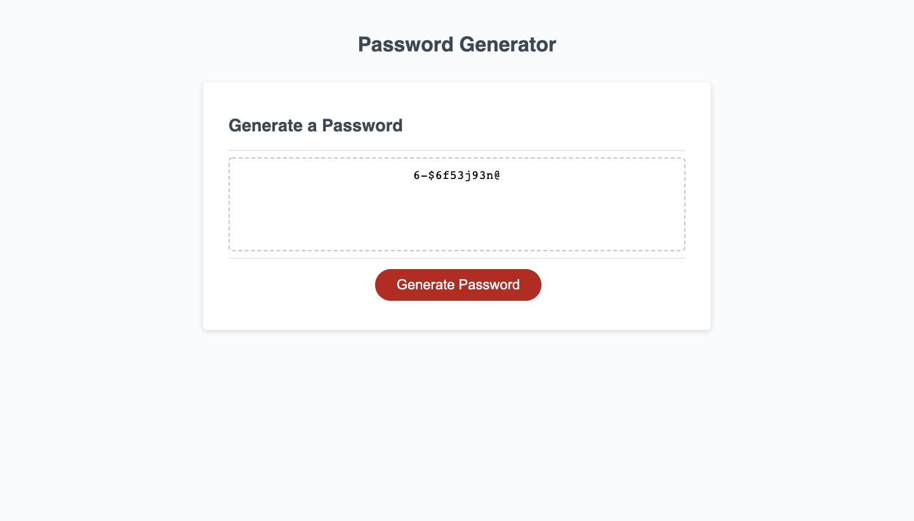

# password-generator

A random password generator that creates a strong password.
When the generate password button is selected it will generate a new random password.

The password must generate a new password which randomly selects from lowercase, uppercase letters, numbers and special characters.

The user is prompted for certain password criteria and alerted if their choices do not meet the requirements.
The random password generated will be the selected criteria.
The random password will be displayed in the box area.

# Languages Used

Javascript, HTML & CSS.
Functions, loops, if statements, alerts, prompts and arrays were used.

# Link to URL

Click the link to view the website [here](https://roxywasiak.github.io/password-generator/)

# Screenshots

Before password

After Password Generated

